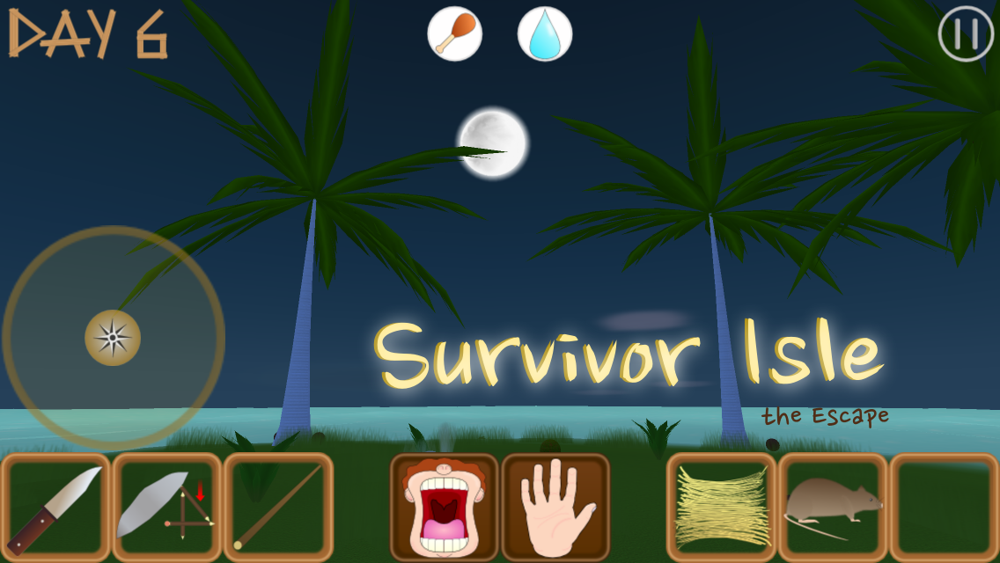
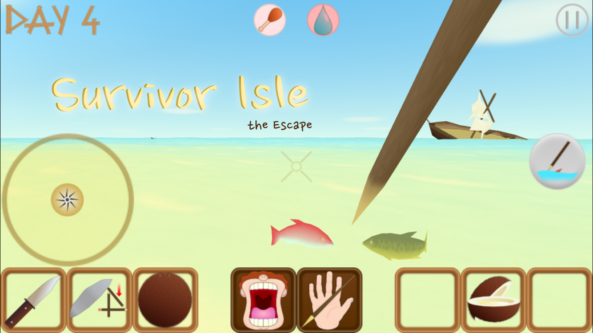
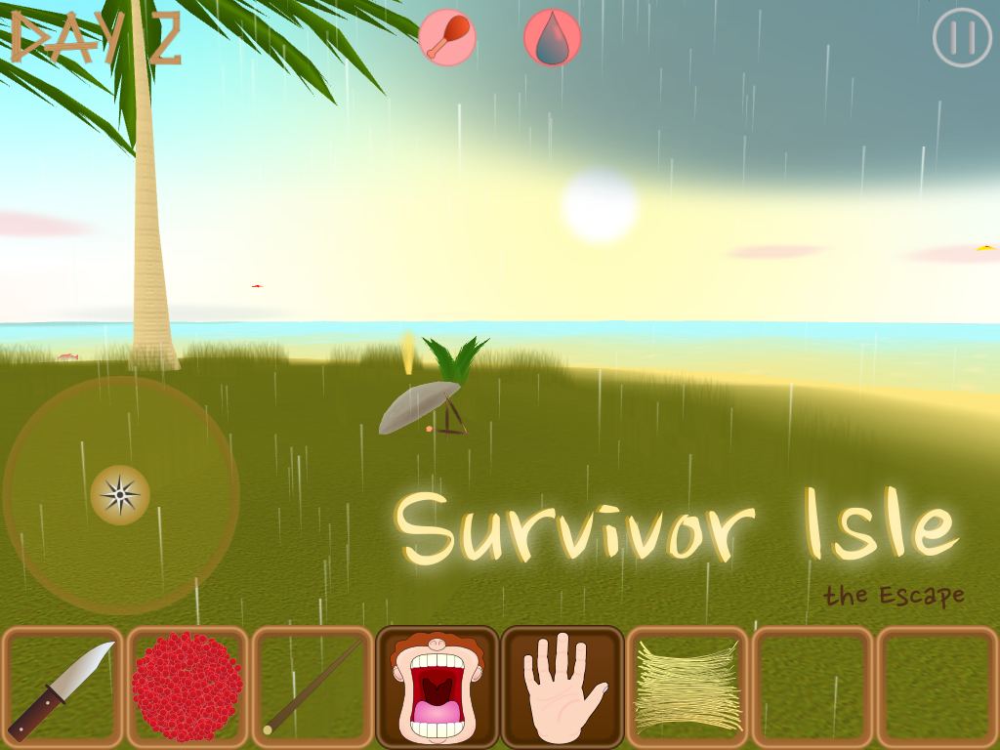
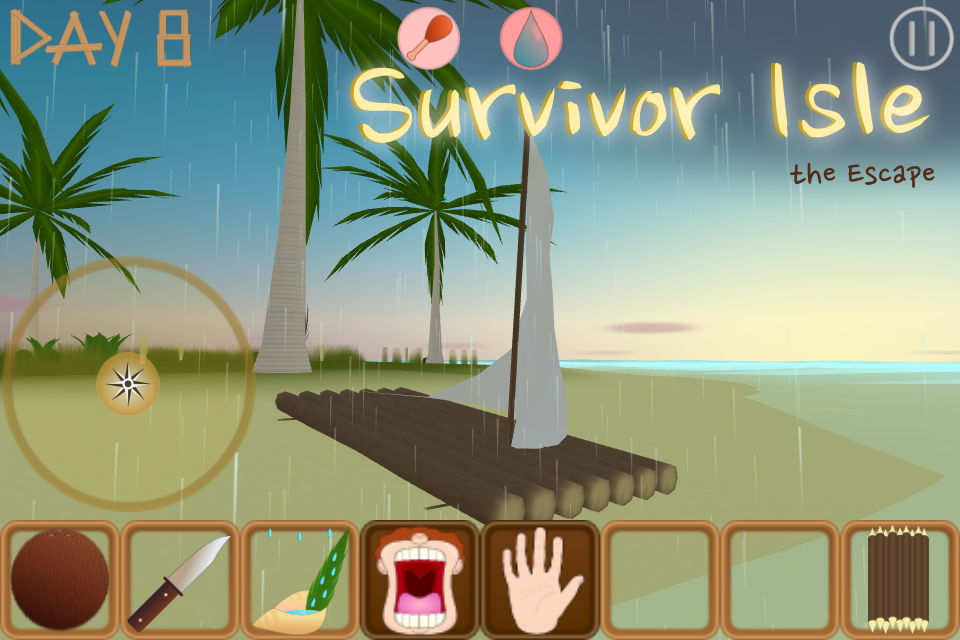

## Survivor Isle: the Escape - an iOS 3D survival adventure game

  

### Info
*Survivor Isle: the Escape* is an iOS 5.1.1+ App store game for iPhone, iPod and iPad.  
Requirements:
- iPhone/IPod touch 4 or newer
- iPad or newer  

[Youtube video](https://www.youtube.com/watch?v=fLNV-mex-d4)  
[Website](https://sites.google.com/site/thebreakgames/home/survivor-isle)  
### Gameplay description
Take the role of a shipwreck survivor stranded on a desert island in the middle of nowhere! Use your ingenuity to survive 7 days by eating and drinking what you can find, collect or catch while building a raft to escape!  
Alone and equipped only with a knife you must explore the island for food, water and collect everything that you could use to make tools to help you to survive, such as spear to spear fish, rainwater collecting tool from a conch shell and a large leaf, figure-4 deadfall traps to catch island rats, kindling to start a fire to cook food, and more. At the same time building a raft – your only hope to leave this island and survive - from the parts of your wrecked ship that are washed up daily on the shore. Be creative and ingenuitive to survive this ordeal!  
Features:
- Interactive 3D environment with changing day/night cycle and dynamic weather.
- Tropical wildlife and natural resources to acquire for survival by using ingenuity and solving puzzles.
- Multiple items to collect and use as necessary or combine together to make new tools.
- Two levels of difficulty.
- Immersion through eye-catching sunsets, starry night skies with a fool moon, dolphins in the distance and sound of a waves crushing in the ocean breeze.  
### Technologies
Developed using Objective-C programming, OpenGL ES 2.0 graphics API and OpenAI sound library.
### Author
Designed and developed by [Ivars Rb.](https://github.com/ivarsrb)  
Copyright © 2015 Ivars Rb.